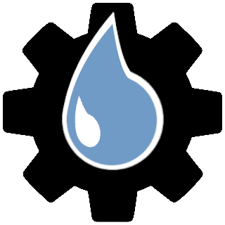

# HydroTools

Tools for retrieving and evaluating hydrological data.

## Documentation

[HydroTools](https://noaa-owp.github.io/hydrotools/) GitHub pages documentation

## Motivation

We developed HydroTools with data scientists in mind. We attempted to ensure the simplest methods such as `get` both accepted and returned data structures frequently used by data scientists using scientific Python. Specifically, this means that [`pandas.DataFrames`](https://pandas.pydata.org/docs/user_guide/dsintro.html#dataframe), [`geopandas.GeoDataFrames`](https://geopandas.readthedocs.io/en/latest/docs/user_guide/data_structures.html#geodataframe), and [`numpy.arrays`](https://numpy.org/doc/stable/reference/arrays.html#array-objects) are the most frequently encountered data structures when using HydroTools. The majority of methods include sensible defaults that cover the majority of use-cases, but allow customization if required.

We also attempted to adhere to organizational (NOAA-OWP) data standards where they exist. This means `pandas.DataFrames` will contain column labels like `usgs_site_code`, `start_date`, `value_date`, and `measurement_unit` which are consistent with organization wide naming conventions. Our intent is to make retrieving, evaluating, and exporting data as easy and reproducible as possible for scientists, practitioners and other hydrological experts.

## What's here?

We've taken a grab-and-go approach to installation and usage of Hydro tools. This means, in line with a standard toolbox, you will typically install just the tool or tools that get your job done without having to install all the other tools available. This means a lighter installation load and that tools can be added to the toolbox, without affecting your workflows!

It should be noted, we commonly refer to individual tools in hydro tools as a subpackage or by their name (e.g. `nwis_client`). You will find this lingo in both issues and documentation.

Currently the repository has the following subpackages:

- `events`: Variety of methods used to perform event-based evaluations of hydrometric time series
- `gcp_client`: Provides methods for retrieving National Water Model data hosted on [Google Cloud Platform](https://console.cloud.google.com/marketplace/details/noaa-public/national-water-model)
- `metrics`: Variety of methods used to compute common evaluation metrics
- `nwis_client`: Provides easy to use methods for retrieving data from the [USGS NWIS Instantaneous Values (IV) Web Service](https://waterservices.usgs.gov/rest/IV-Service.html)
- `\_restclient`: A generic REST client with built in cache that make the construction and retrieval of GET requests painless

## UTC Time

Note: the canonical `pandas.DataFrames` used by HydroTools use time-zone naive datetimes that assume UTC time. In general, do not assume methods are compatible with time-zone aware datetimes or timestamps. Expect methods to transform time-zone aware datetimes and timestamps into their timezone naive counterparts at UTC time.

## Usage

Refer to each subpackage's `README.md` or documentation for examples of how to use each tool.

## Installation

In accordance with the python community, we support and advise the usage of virtual environments in any workflow using python. In the following installation guide, we use python's built-in `venv` module to create a virtual environment in which the tools will be installed. Note this is just personal preference, any python virtual environment manager should work just fine (`conda`, `pipenv`, etc. ).

```bash
# Create and activate python environment, requires python >= 3.8
$ python3 -m venv venv
$ source venv/bin/activate
$ python3 -m pip install --upgrade pip

# Install all tools
$ python3 -m pip install hydrotools

# Alternatively you can install a single tool
#  This installs the NWIS Client tool
$ python3 -m pip install hydrotools.nwis_client
```

## Categorical Data Types

`hydrotools` uses `pandas.Dataframe` that contain `pandas.Categorical` values to increase memory efficiency. Depending upon your use-case, these values may require special consideration. To see if a `Dataframe` returned by `hydrotools` contains `pandas.Categorical` you can use `pandas.Dataframe.info` like so:

```python
print(my_dataframe.info())

<class 'pandas.core.frame.DataFrame'>
Int64Index: 5706954 entries, 0 to 5706953
Data columns (total 7 columns):
 #   Column            Dtype         
---  ------            -----         
 0   value_date        datetime64[ns]
 1   variable_name     category      
 2   usgs_site_code    category      
 3   measurement_unit  category      
 4   value             float32       
 5   qualifiers        category      
 6   series            category      
dtypes: category(5), datetime64[ns](1), float32(1)
memory usage: 141.5 MB
None
```

Columns with `Dtype` `category` are `pandas.Categorical`. In most cases, the behavior of these columns is indistinguishable from their primitive types (in this case `str`) However, there are times when use of categories can lead to unexpected behavior such as when using `pandas.DataFrame.groupby` as documented [here](https://stackoverflow.com/questions/48471648/pandas-groupby-with-categories-with-redundant-nan). `pandas.Categorical` are also incompatible with `fixed` format HDF files (must use `format="table"`) and may cause unexpected behavior when attempting to write to GeoSpatial formats using `geopandas`.

Possible solutions include:

### Cast `Categorical` to `str`

Casting to `str` will resolve all of the aformentioned issues including writing to geospatial formats.

```python
my_dataframe['usgs_site_code'] = my_dataframe['usgs_site_code'].apply(str)
```

### Remove unused categories

This will remove categories from the `Series` for which no values are actually present.

```python
my_dataframe['usgs_site_code'] = my_dataframe['usgs_site_code'].cat.remove_unused_categories()
```

### Use `observed` option with `groupby`

This limits `groupby` operations to category values that actually appear in the `Series` or `DataFrame`.

```python
mean_flow = my_dataframe.groupby('usgs_site_code', observed=True).mean()
```
